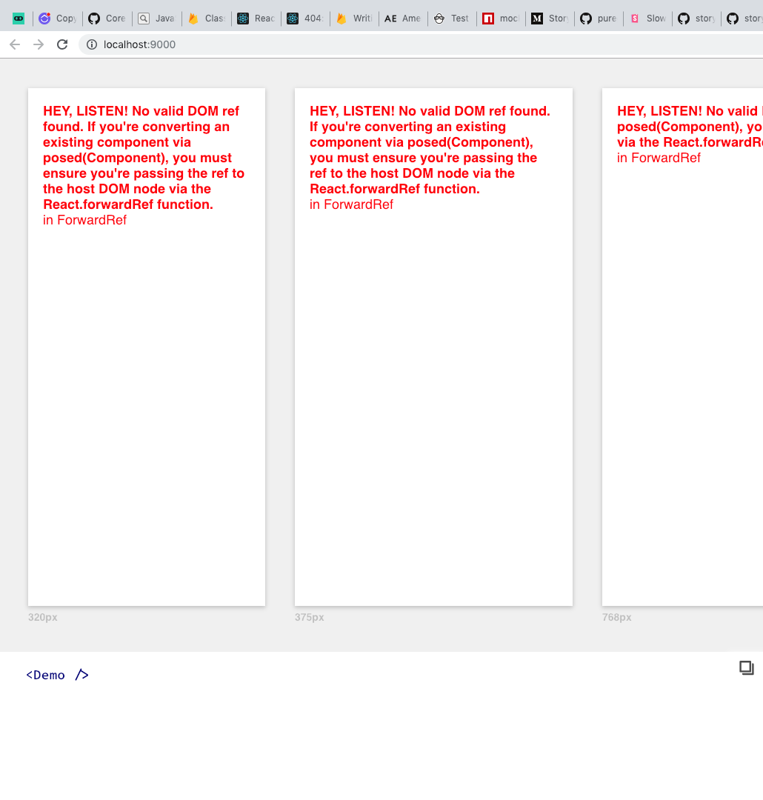

# Playroom and `react-pose`

I'm unable to use Playroom with `react-pose` components, although they render just fine in a normal environment. While attempting to render a `posed` component, I get the following error:

You can replicate this by running `npm run playroom` or `yarn playroom` from the root of this repository. If you want to see the working, animated component, you can run `npm start` or `yarn start` from the root of the repo too.
